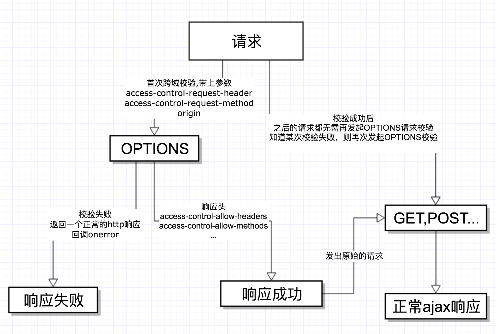

为了解决ajax的同源策略，CORS在保证安全的前提下，允许使用XMLHttpRequest
> 跨域并未浏览器限制发起跨站请求，而是在返回结果的时候被浏览器拦截了。

## 简单的跨域
``` bash
#请求
GET /resources/public-data/ HTTP/1.1
Host: A.com
Origin: http://A.com    #表示请求源
...
#响应
HTTP/1.1 200 OK
Access-Control-Allow-Origin: *  #被允许的请求源，这里表示允许所有源访问该资源
...
```
## 预请求机制
“预请求”要求发送一个OPTIONS请求到目标站点来查明对目标站点是否安全可接受的。
### 请求具备一下条件，就会发起预请求
- 以GET,POST,HEAD以外的方式发起请求
- `Content-Type`不是`application/x-www-form-urlencoded, multipart/form-data` 或者` text/plain`
- 使用自定义请求头

### 服务器与浏览器请求流程

