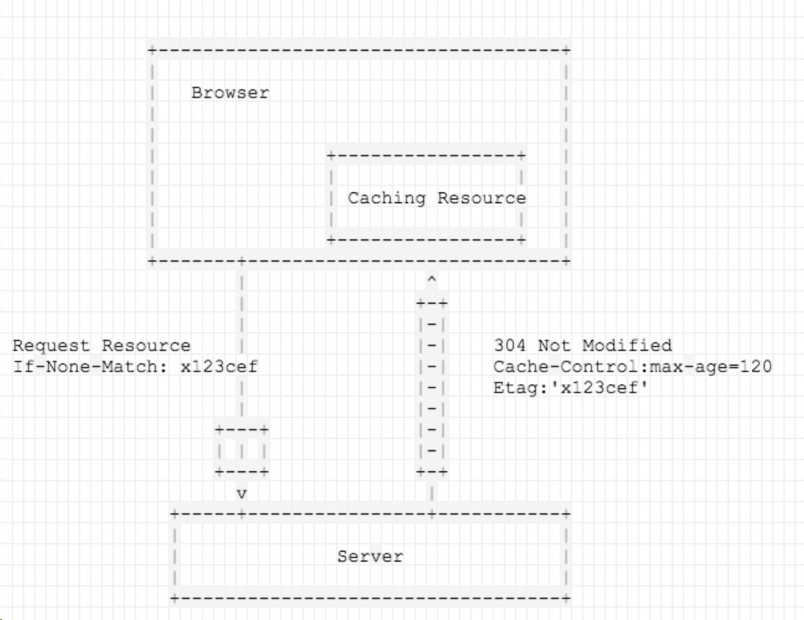
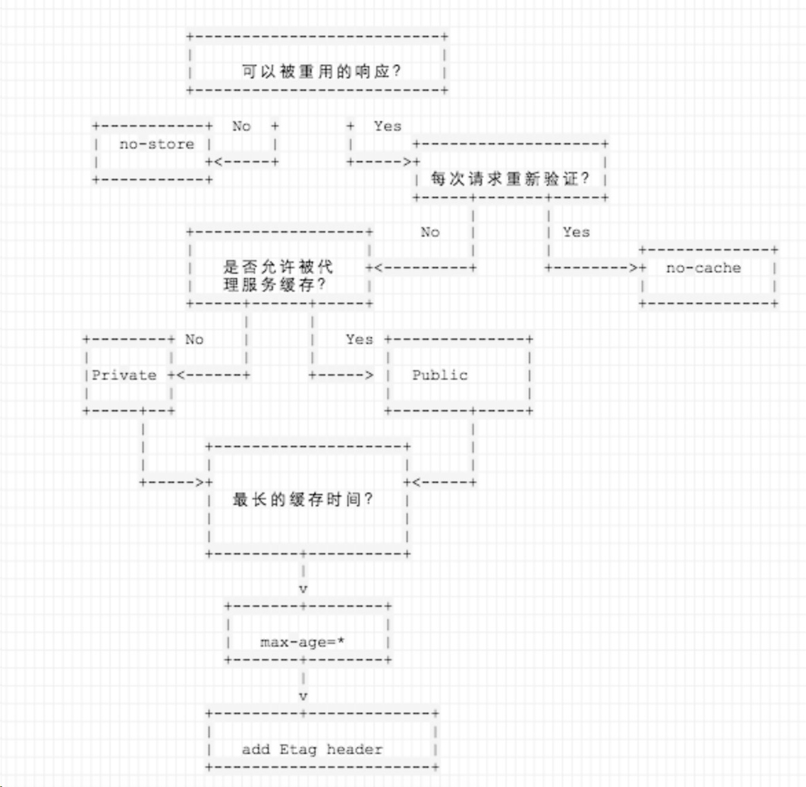

浏览器初次请求->成功->带上Content-length,Cache-Control,Etage->加入缓存池

## Etag:用于响应过期后，用于验证资源是否过期
浏览器在资源缓存时间过期之后，If-None-Match 带上Etage向服务器发起请求判缓存时候过期
如果缓存没有过期，服务器返回304 Not Modified以及原来的Etage

## Cache-Control定义资源以什么方式缓存，以及缓存多久
- **no-cache** 必须先向服务器确认响应是否被更改，然后才会对后续的同一个网址进行該响应操作，如果存在合适Etage，每次请求都会带上Etage校验缓存是否有效，如果服务器返回no-modified ，则资源不会被下载
- **no-store** 禁止缓存任何响应
- **public** 强制缓存，即使关联http认证，或者状态码无法正常缓存
- **private** 只为单个用户缓存。
- **max-age** 设置缓存时间，单位秒

## 浏览器中的Cache-Control
- **no-cache** 告诉浏览器即使存在缓存也向服务器索取数据

#### ctrl+f5一般浏览器带上 `cache-control:no-cache;prama:no-cache` 发送请求，即使浏览器中存在符合条件的请求也从服务器上拉去资源
- prama:no-cache ： 用于兼容HTTP1.0版本


